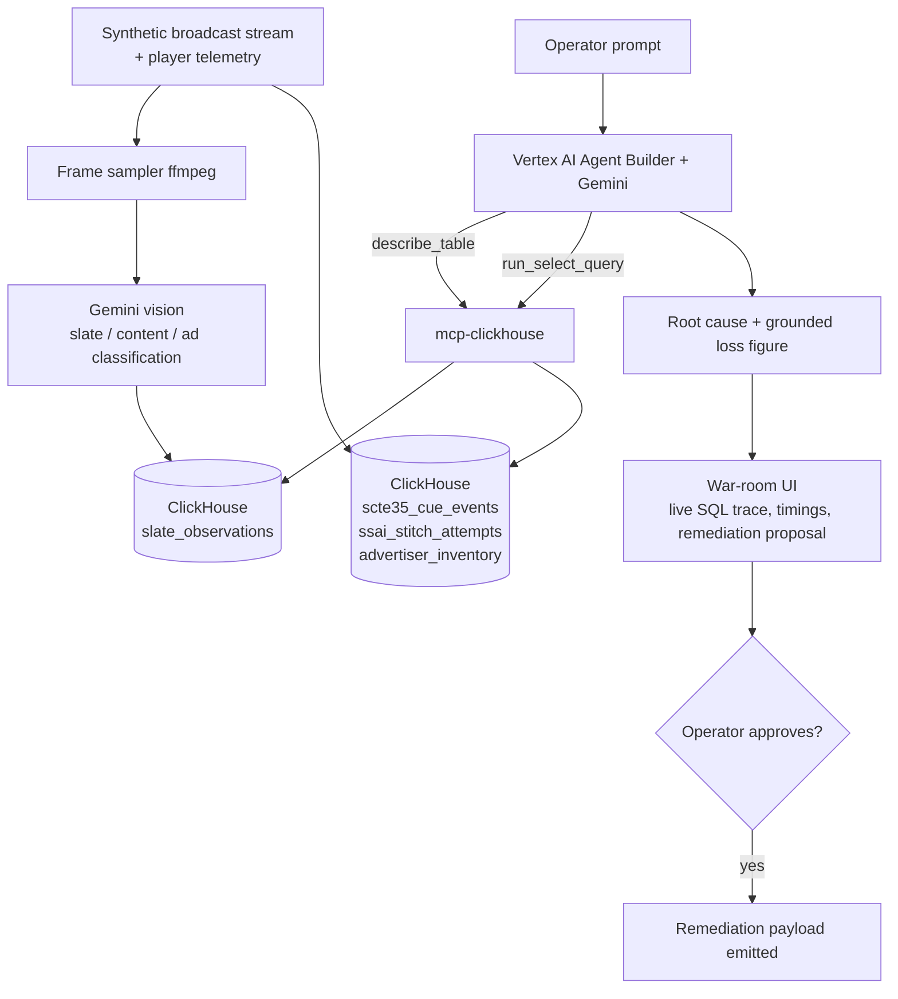

# GhostSlate AI

**Autonomous SSAI "Silent Bleed" Forensics — Agentic Cinema Hackathon, ClickHouse Track**

Submission deadline: **9 Sept 2026, 2:00pm PDT** (~2:30am IST, 10 Sept). Go/no-go checkpoint: **27 Aug**.

---

## 1. The Problem

In live sports and FAST channels, ads are stitched into the stream server-side (SSAI), triggered by
SCTE-35 cue markers. When an ad auction times out or a cue drifts, the stitcher does not crash — it
falls back to a looping "We'll Be Right Back" slate.

Every monitoring layer reports **HTTP 200 OK**. Video is playing. Nothing alerts. Meanwhile paid ad
inventory has been silently replaced with zero-revenue filler.

This is the core insight: **the failure is invisible to logs but obvious to the eye.** That gap is
exactly what a multimodal agent closes, and it is why this project needs Gemini rather than any
text-to-SQL model.

## 2. What GhostSlate Does

A forensic agent that:

1. **Sees** the slate — Gemini vision classifies sampled player frames, detecting filler cards that
   status codes hide.
2. **Explains** it — correlates each visual detection against SCTE-35 cue events and SSAI stitcher
   logs in ClickHouse using ASOF JOIN temporal matching.
3. **Prices** it — computes unmonetized impressions against a real rate-card table, so the financial
   figure is derived from data, not invented by the model.
4. **Proposes** a fix — emits a remediation payload (auction timeout override, fallback DSP pod) for
   **human approval**. It does not auto-execute against ad infrastructure.

## 3. Scope (deliberately narrow)

| In scope                                      | Out of scope                          |
| --------------------------------------------- | ------------------------------------- |
| One FAST channel                              | Multi-tenant / multi-channel ops      |
| One primary failure mode: SSP auction timeout | Encoder cue drift (stretch goal only) |
| Vision + log correlation + loss attribution   | Auto-remediation execution            |
| One polished war-room screen                  | Full observability platform           |

Design is judged as _"a complete, coherent product experience, not a proof of concept."_ Narrow and
finished beats broad and rough.

## 4. Flow



**Agent loop:** schema discovery → visual anomaly window identification → ASOF JOIN correlation →
dimension isolation (SSP × device × codec × VAST version) → loss computation → remediation proposal.
Every number in the final answer must cite a value returned by ClickHouse.

## 5. Data Model

- `scte35_cue_events` — channel_id, splice_event_id, cue_time (DateTime64(3)), avail_num,
  segmentation_type_id, expected_duration_ms
- `ssai_stitch_attempts` — channel_id, splice_event_id, attempt_time, stitch_status, ssp_id,
  ad_response_latency_ms, device_class, codec, vast_version
- `slate_observations` — session_id, channel_id, observed_at, frame_class, confidence _(written by
  Gemini vision)_
- `advertiser_inventory` — channel_id, daypart, cpm_usd, fill_target_pct _(grounds the loss figure)_

`LowCardinality` on ssp_id / device_class / codec / stitch_status. `AggregatingMergeTree` rollups for
auction-latency quantiles. These two are used because the query pattern needs them — resist adding
features purely to showcase them.

### Corrected ASOF JOIN

ASOF returns exactly **one** matched row per left row. Aggregating a percentage per
`splice_event_id` therefore yields only 0% or 100%. Aggregate _across_ cues instead:

```sql
WITH matched AS (
    SELECT
        c.channel_id             AS channel_id,
        c.splice_event_id        AS splice_event_id,
        s.ssp_id                 AS ssp_id,
        s.device_class           AS device_class,
        s.stitch_status          AS stitch_status,
        s.ad_response_latency_ms AS latency_ms
    FROM scte35_cue_events AS c
    ASOF LEFT JOIN ssai_stitch_attempts AS s
      ON c.channel_id = s.channel_id
     AND c.splice_event_id = s.splice_event_id
     AND s.attempt_time >= c.cue_time
    WHERE c.cue_time BETWEEN {from:DateTime64(3)} AND {to:DateTime64(3)}
)
SELECT
    channel_id,
    ssp_id,
    device_class,
    count()                                                        AS cues,
    countIf(stitch_status = 'SLATE_FALLBACK')                      AS slate_cues,
    round(100.0 * countIf(stitch_status = 'SLATE_FALLBACK') / count(), 2) AS slate_bleed_pct,
    quantileTDigest(0.95)(latency_ms)                              AS p95_auction_ms
FROM matched
GROUP BY channel_id, ssp_id, device_class
HAVING cues >= 20 AND slate_bleed_pct > 5
ORDER BY slate_bleed_pct DESC;
```

The `cues >= 20` guard suppresses small-sample false positives — cheap, and it signals statistical
care to judges.

## 6. Synthetic Data — Credibility Rules

The weakest point of any hackathon demo is an agent "discovering" an anomaly the author planted.
Counter it deliberately:

- **Scale:** 100M+ rows minimum. 10M is laptop-scale and will not impress ClickHouse judges.
- **Generate the baseline in-database** with `INSERT ... SELECT ... FROM numbers()` — orders of
  magnitude faster than pushing rows from Python. Use Python only to inject anomalies.
- **Confounders:** include benign latency spikes, one unrelated regional CDN blip, and diurnal
  traffic patterns, so the true cause must actually be isolated rather than spotted.
- **Negative control:** include a window with _no_ real root cause and show the agent correctly
  reporting that none was found. An agent that declines to hallucinate is more convincing than one
  that always succeeds.

## 7. Technology Stack

**All versions verified against the npm registry on 18 Aug 2026.** Single-version enforcement is
described in `AGENTS.md`; the short version is that every shared dependency is declared once in the
pnpm `catalog:` and referenced by name, so two copies of the same technology cannot drift apart.

### Runtime

|            | Version                     | Note                                             |
| ---------- | --------------------------- | ------------------------------------------------ |
| Node       | **24.19.0 LTS ("Krypton")** | Current LTS line. Node 26 is newer but _not_ LTS |
| pnpm       | **11.22.0**                 | Pinned via `packageManager`                      |
| TypeScript | **6.0.3**                   | See note below                                   |

**On TypeScript 7:** 7.0.2 is published and is `latest` on npm — it's the native Go port. But it has
exactly one stable patch release, and the surrounding toolchain (typed ESLint, Vite plugins, editor
language service) is where a brand-new compiler rewrite bites. On a ten-day budget that is a bad
trade, so this pins **6.0.3**. Moving to 7 later is a one-line change in the catalog.

### Server (`server/`)

| Package            | Version         |
| ------------------ | --------------- |
| express            | 5.2.1           |
| @types/express     | 5.0.6           |
| @clickhouse/client | 1.23.1          |
| @google/genai      | 2.17.1          |
| zod                | 4.4.3           |
| pino / pino-http   | 10.3.1 / 11.0.0 |
| tsx                | 4.23.12         |
| vitest             | 4.1.11          |
| @types/node        | 24.13.3         |

`@types/node` is pinned to the **24.x** line to match the Node 24 runtime — not the newer 26.x,
which would type against APIs the runtime does not have.

### Web (`web/`)

| Package                         | Version          |
| ------------------------------- | ---------------- |
| react / react-dom               | 19.2.8           |
| vite                            | 8.2.1            |
| @vitejs/plugin-react            | 6.0.5            |
| tailwindcss / @tailwindcss/vite | 4.3.3            |
| recharts                        | 3.10.1           |
| @types/react / @types/react-dom | 19.2.18 / 19.2.4 |

### Tooling

eslint 10.8.1 · typescript-eslint 8.67.0 · prettier 3.9.6

### Python (`tools/generator/` only)

clickhouse-connect 0.9.6 · faker 38.2.0 — anomaly injection only. The 100M-row baseline is generated
inside ClickHouse with `INSERT ... SELECT FROM numbers()`.

### Infrastructure

ClickHouse Cloud (30-day trial) · official `mcp-clickhouse` server, containerised · Vertex AI Agent
Builder + latest Gemini · Google Cloud Run · ffmpeg · docker-compose for local and judge setup.

### Express + SSE gotcha

The war-room trace streams over SSE. Do **not** add `compression` middleware to the SSE route — it
buffers events into clumps. Set `Content-Type: text/event-stream`, `Cache-Control: no-cache`,
`Connection: keep-alive`, and call `res.flushHeaders()` before the first write. Give the Cloud Run
service a generous request timeout, since an agent run can span tens of seconds.

### Why plain React rather than Next.js

Framework choice is not scored. The consequence that matters: a React SPA cannot hold Google Cloud
or ClickHouse credentials, so an explicit Express server is required — not optional. One container
serves the built static assets _and_ the API, keeping judge setup to a single `docker-compose up`.

## 8. Evaluation Harness

A ground-truth matrix (`eval/`) asserting, per scripted incident: expected root-cause dimension found,
minimum MCP tool calls made, final answer cites real ClickHouse values, and — for the negative
control — that no cause is asserted. This directly serves the Technological Implementation score and
protects your demo from a bad run on recording day.

## 9. Submission Checklist

- [ ] Public repo with **OSI-approved license permitting commercial use**, visible in About
- [ ] Hosted project URL (Cloud Run)
- [ ] ≤3 min demo video, public on YouTube/Vimeo, English or subtitled
- [ ] **No real broadcast footage** — synthetic or openly-licensed video only
- [ ] Genuine runtime calls to both Google Cloud and ClickHouse — README mentions are explicitly insufficient
- [ ] ClickHouse reached via the official `mcp-clickhouse` server
- [ ] Track selected: ClickHouse
- [ ] Built entirely within the contest period; no code carried over from existing work

## 10. Demo Script (3 min)

1. **0:00** — Stream plays. Slate appears. Every dashboard shows green, HTTP 200. _"Nothing is alerting. This channel is losing money right now."_
2. **0:25** — Prompt: _"Sponsorship revenue dropped 18% during the Q3 break. Audit cue markers and stitcher logs for unmonetized slate bleed."_
3. **0:40** — Gemini vision flags the slate frames; UI shows classified thumbnails.
4. **1:00** — Live MCP trace: schema discovery → ASOF JOIN correlation → dimension isolation. Real SQL, real timings, rows scanned.
5. **1:50** — Diagnosis: SSP auction latency breaching the stitcher deadline for one device/codec cohort. Loss figure computed from the rate-card table.
6. **2:20** — Negative control: a second window where the agent correctly reports no root cause.
7. **2:40** — Remediation proposal, operator approves, close.

## 11. Timeline

| Dates        | Work                                                                                   |
| ------------ | -------------------------------------------------------------------------------------- |
| Aug 18–22    | SCTE-35/SSAI domain study; schema + baseline data at scale; benchmark queries sub-50ms |
| Aug 23–27    | MCP server standalone; Agent Builder tool-calling loop working end to end              |
| **Aug 27**   | **Go/no-go — if domain modeling hasn't converged, switch to StreamOps Commander**      |
| Aug 28–Sep 2 | Vision pipeline; war-room UI; loss attribution                                         |
| Sep 3–5      | Eval harness; confounders + negative control; Cloud Run deploy                         |
| Sep 6–7      | Demo video, README, license                                                            |
| Sep 8        | Buffer — deadline is 2:30am IST, treat Sep 8 as the real cutoff                        |

## Open items to verify yourself

- Confirm the live Devpost countdown: Google's announcement said Sept 7, the Devpost page says Sept 9.
- Verify any customer claims (Netflix/Disney+/Sony LIV on ClickHouse) before putting them in the submission.
