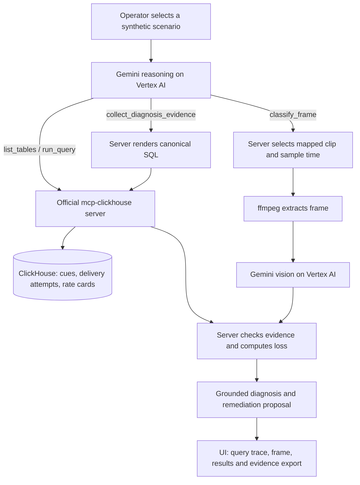

<div align="center">

<picture>
  <source media="(prefers-color-scheme: dark)" srcset="web/public/brand/ghostslate-lockup-dark.png">
  <source media="(prefers-color-scheme: light)" srcset="web/public/brand/ghostslate-lockup.png">
  
</picture>

**Find out why viewers are seeing a holding screen instead of paid ads—even when the video keeps playing.**

AI-assisted investigation of SSAI ad failures for broadcast and advertising operations teams.

[Problem](#the-problem) · [Demo walkthrough](#demo-walkthrough) · [Terminology](#the-technical-terms-in-plain-language) · [Architecture](#how-it-works) · [Local setup](#local-setup)

[](LICENSE)
[](https://github.com/ClickHouse/mcp-clickhouse)
[](https://cloud.google.com/vertex-ai)

</div>

## The problem

A live channel reaches an ad break. An ad supplier responds too late, so viewers see a
“We'll be right back” card—or a black screen—instead of an advertisement. The video still plays,
so a playback-availability check can look healthy while advertising opportunities are lost.

The clues exist in delivery logs, but an operator must connect them: what viewers saw, which ads
failed, which viewers were affected, and how much revenue was at risk. GhostSlate brings those
checks into one investigation screen.

## What GhostSlate does

For a broadcast or ad-operations analyst investigating a suspected ad-delivery failure, GhostSlate:

1. **Finds the affected group.** Compares ad-delivery records to isolate an ad supplier, device
   category, and video format with unusually high failures.
2. **Checks what viewers would see.** Uses Gemini vision to inspect the synthetic video frame
   assigned to that demo scenario and confirm a holding screen.
3. **Calculates the financial exposure.** Combines failed ad opportunities with the stored price
   per thousand impressions. The server calculates the amount; the model does not invent it.
4. **Shows the evidence and a proposed response.** The operator can inspect database queries,
   results, visual evidence, and the final diagnosis before considering a targeted reroute.

When evidence is weak or the failure is not isolated, it reports that limitation instead of blaming
a supplier. It never changes real advertising infrastructure. Local development supports a mock
approval event; production blocks approval emission.

### A concrete example

In the **synthetic primary incident**, the affected group is `ssp-beta` serving connected TVs using
HEVC video. During the four-hour window, 59,482 of its 60,862 ad-delivery attempts were unmonetized
(97.73%). At the seeded rate of $32.50 per thousand impressions, the calculated exposure is
**$1,933.17**. A sampled frame confirms a holding card.

These are reproducible demo results, **not customer revenue, measured savings, or money recovered**.
See the [captured evaluation evidence](eval/README.md) and
[query benchmarks](sql/benchmarks/005-query-correctness.md) for provenance.

## Demo walkthrough

**Hosted demo and video:** verified public links have not yet been added to this repository.
Until they are published, use the [local setup](#local-setup) below. Deployment configuration and
historical captures are not proof that a hosted instance is currently available.

Once the app is running:

1. Select **Primary incident** and start its investigation using the supplied prompt.
2. Watch the query trace and classified frame. Inspect the final affected group and financial
   exposure against the example above.
3. Select **Negative control** and investigate again. Expect no isolated root cause or dollar loss.
4. Select **Insufficient evidence**. Expect the app to decline attribution because too few distinct
   ad breaks were observed—even though delivery attempts exist.
5. Review the remediation proposal on a positive case. In local development only, approval emits
   a mock event. On production, stop at reviewing the proposal: approval is disabled.

The selector also includes **Latency confounder**, **Set-top-box errors**, and **Black-screen timeout**
cases. See the [six-case evaluation matrix](eval/README.md) for exact expected outcomes. Evidence can
be exported from the UI. Cached replay works only while the run remains in the same server process;
a restart, eviction, or another instance can make it unavailable.

## The technical terms, in plain language

| Term                                              | Meaning in GhostSlate                                                                                            |
| ------------------------------------------------- | ---------------------------------------------------------------------------------------------------------------- |
| **SSAI** — server-side ad insertion               | Adding advertisements to a video stream on the server before it reaches the viewer.                              |
| **FAST** — free ad-supported streaming television | Scheduled streaming channels funded by advertising rather than a subscription.                                   |
| **SCTE-35 cue**                                   | A signal in the broadcast stream marking an opportunity for an ad break.                                         |
| **Stitcher**                                      | The service that inserts the selected advertisement into the stream.                                             |
| **Slate / silent bleed**                          | A holding card replacing an ad; “silent bleed” describes lost ad opportunities while playback remains available. |
| **SSP** — supply-side platform                    | A platform helping a publisher sell its ad inventory; the demo distinguishes four suppliers.                     |
| **Codec / cohort**                                | A video encoding format, such as HEVC; a cohort is a group sharing supplier, device, and codec.                  |
| **CPM**                                           | Price per thousand ad impressions, used here to value unmonetized opportunities.                                 |
| **ASOF JOIN**                                     | A time-based database join that links each delivery attempt to its preceding matching cue.                       |
| **MCP** — Model Context Protocol                  | The tool interface through which the agent asks ClickHouse questions.                                            |
| **SSE** — server-sent events                      | A connection that delivers investigation updates to the browser as they happen.                                  |

## How it works



The model chooses exploratory questions and when to request finalization. The server owns the
canonical evidence query, incident decision, arithmetic, and final diagnosis. Vision confirms the
scenario's mapped sample; it does not discover a live stream or determine the loss amount.

**All agent database calls use the official `mcp-clickhouse` server over SSE.** Dashboard metrics
come from the same investigation evidence, not a separate direct database client. Frame results are
returned to the investigation and cached in memory. The schema includes `slate_observations`, but
the current runtime does **not** write classifications to it.

### Why ClickHouse and Gemini

- **ClickHouse** stores 101.4 million synthetic delivery attempts. Its `ASOF JOIN` matches attempts
  to cues; conditional aggregation counts failed opportunities; `quantileTDigest` measures p95
  auction latency; a rate-card join supplies prices. Channel/time filters narrow the work.
- **Gemini reasoning** uses `@google/genai` with `vertexai: true` to select tools and investigate.
  **Gemini vision** classifies actual extracted pixels as slate, ad, or content.
- **The server's evidence gates** require enough distinct cues, a high failure rate, and separation
  from peer groups. Positive diagnoses also require visual slate confirmation. See
  [decision constants](server/src/services/incident.constants.ts) and the [evaluation harness](eval/README.md).

The UI shows executed SQL, returned rows, and application-measured tool-call duration. **Rows
scanned are shown only when MCP supplies them.** The pinned MCP version's historical captures omit
that statistic. Direct database benchmarks report scan counts and database execution time
separately; those measurements are not substituted into a live trace. Subsecond SQL timings are
not a claim that a complete multi-turn investigation finishes in under a second.

### Current scope and limitations

- One channel, six fixed demo scenarios, and one primary failure mechanism: late ad responses.
- Synthetic telemetry, seeded rate cards, and bundled synthetic clips—not a production stream feed.
- Scenario-bound visual confirmation, not telemetry-row-to-video-frame synchronization.
- Business counts, rates, latency, and pricing come from ClickHouse; visual confidence comes from
  Gemini vision, and decision thresholds are server constants. These are distinct evidence sources.
- No real rerouting, billing integration, operator authentication, or durable distributed run cache.
- No measured customer savings, manual-investigation speedup, or hosted per-run cost is claimed.

## Local setup

### Prerequisites

- Node **24.19.0** (`nvm use`) and pnpm **11.22.0**.
- Docker with Compose; allow disk and memory for the 101.4M-row dataset.
- **ffmpeg on your PATH** for runtime frame extraction when running the API on your host.
- Google Cloud CLI (`gcloud`), a billing-enabled project with Vertex AI enabled, and an identity
  permitted to invoke Gemini. Live investigations make billable Google Cloud calls.

### 1. Clone and configure

```bash
git clone https://github.com/jaswalsaurabh/ghostslate.git
cd ghostslate
nvm use
corepack enable
corepack prepare pnpm@11.22.0 --activate
cp .env.example .env
```

Edit `.env`: set `GCP_PROJECT_ID`, select `GCP_REGION` (default `us-central1`), and set
`MCP_SERVER_URL=http://localhost:8000` for host development. Keep the documented local ClickHouse
defaults for this path. Never reuse local development passwords in a public deployment.

The Node development command does not automatically load `.env`. In the **same terminal** used
for the remaining commands, export your trusted, locally edited file:

```bash
set -a
. ./.env
set +a
```

This executes shell assignments; do not source an untrusted file. See [.env.example](.env.example)
for all settings. Credentials stay on the server, never in frontend environment variables.

### 2. Authenticate to Google Cloud

```bash
gcloud config set project "$GCP_PROJECT_ID"
gcloud auth application-default login
gcloud auth application-default set-quota-project "$GCP_PROJECT_ID"
```

Application Default Credentials (ADC) let the SDK authenticate without embedding a key in the app.
Enable the Vertex AI API and grant the invoking identity appropriate access before continuing.

### 3. Start and seed the database

```bash
docker compose -f infra/docker-compose.yml up -d clickhouse mcp-clickhouse incident-injector
docker compose -f infra/docker-compose.yml logs -f incident-injector
```

Wait for the one-shot injector to finish successfully before investigating. On an empty volume,
Compose applies the schema, creates a read-only agent account, seeds rate cards and baseline rows,
then injects the synthetic incidents. Initial startup can take several minutes depending on your
machine. Existing data persists in the `clickhouse_data` volume.

```bash
docker exec ghostslate-clickhouse clickhouse-client \
  --user default --password "$CLICKHOUSE_ADMIN_PASSWORD" \
  --query "SELECT table, total_rows FROM system.tables WHERE database = 'ghostslate'"
```

Expect 4 inventory rows, 14,400 cues, 101,400,000 attempts, and 0 `slate_observations` rows.
The last table remains empty in the current runtime. For mutation verification, see the
[generator guide](tools/generator/README.md).

### 4. Start the app

```bash
pnpm install --frozen-lockfile
pnpm dev
```

Open [the local UI](http://localhost:5173). The API is at [localhost:8080](http://localhost:8080).
In another terminal, check `curl http://localhost:8080/api/health`: verify **`mcp.connected: true`**,
not just `status: "ok"`. This checks MCP connectivity, not a full Vertex AI investigation.
Then follow the [demo walkthrough](#demo-walkthrough).

For the API/UI inside Docker, use the [credential-mounted Docker instructions](infra/README.md#local-app-in-docker).
For ClickHouse Cloud, use the [Cloud data setup](infra/README.md#seed-clickhouse-cloud).

### Common issues

| Symptom                              | Check                                                                                                                       |
| ------------------------------------ | --------------------------------------------------------------------------------------------------------------------------- |
| Agent cannot reach MCP               | Host API: `http://localhost:8000`; container API: `http://mcp-clickhouse:8000`. Verify matching bearer tokens.              |
| Wrong project or missing credentials | Export `.env` into the host terminal, authenticate ADC, and verify Vertex AI access. Docker needs its own credential mount. |
| Frame extraction fails               | Host API needs ffmpeg on PATH. The Docker image already includes it.                                                        |
| No expected incident                 | Wait for the injector and verify its ledger; baseline seeding alone does not create the incident.                           |
| Wrong Node version                   | Run `nvm use` before installing or starting the app.                                                                        |

**Reset warning:** `docker compose -f infra/docker-compose.yml down -v` permanently deletes this
stack's database volume, including injected data and the ledger. Use it only for a deliberate local
reset, never as the first troubleshooting step. Back up any data you need first.

## Technical reference and development

| Component                         | Current role                                                                  |
| --------------------------------- | ----------------------------------------------------------------------------- |
| Node 24 / TypeScript / pnpm       | Server runtime, typed application code, workspace management.                 |
| Express 5 / Zod / Pino            | HTTP boundary, input decoding, structured logs.                               |
| React 19 / Vite / Tailwind v4     | Investigation UI with shared primitives and semantic design tokens.           |
| Official `mcp-clickhouse`         | SSE tool server; agent calls `list_tables` and `run_query`.                   |
| Gemini / `@google/genai` / ffmpeg | Vertex AI reasoning and vision; local frame extraction.                       |
| Python / `clickhouse-connect`     | Offline/admin incident injection; baseline generation runs inside ClickHouse. |
| Docker / Cloud Run                | Local services and production deployment configuration.                       |

Dependency versions live in [package manifests](package.json) and the
[workspace catalog and overrides](pnpm-workspace.yaml), rather than a second version table here.

| API                                                      | Behaviour                                                                    |
| -------------------------------------------------------- | ---------------------------------------------------------------------------- |
| `GET /api/health`                                        | Service status and MCP connectivity.                                         |
| `GET /api/investigation-scenarios`                       | Server-owned scenario catalog.                                               |
| `POST /api/vision/classify`                              | Scenario-authorized frame classification.                                    |
| `POST /api/investigate/spike`                            | Starts or attaches to a run; returns JSON containing `runKey` and `created`. |
| `GET /api/investigate/runs/:runKey/stream`               | Streams that session's run via SSE.                                          |
| `GET /api/investigate/runs/:runKey/remediation`          | Returns proposal state.                                                      |
| `POST /api/investigate/runs/:runKey/remediation/approve` | Local mock approval; rejected in production.                                 |

```bash
pnpm dev
pnpm build
pnpm test
pnpm typecheck
pnpm lint
pnpm format:check
pnpm check:lines
pnpm dedupe:check
```

`pnpm dev:clickhouse-cloud` starts a local MCP container for an existing seeded Cloud database;
export `CLICKHOUSE_CLOUD_HOST`, `CLICKHOUSE_CLOUD_USER`, `CLICKHOUSE_CLOUD_PASSWORD`, and
`CLICKHOUSE_MCP_AUTH_TOKEN` first. The Cloud account must be read-only.

- [Project overview](PROJECT-OVERVIEW.md): architecture, scope, and lessons learned.
- [SQL guide](sql/README.md): schema, canonical queries, pricing periods, benchmarks.
- [Evaluation guide](eval/README.md): offline tests and provenance of captured live runs.
- [Infrastructure guide](infra/README.md): Docker credentials, Cloud setup, deployment limitations.
- [Security](SECURITY.md): threat model, production controls, and reporting.
- [Engineering rules](AGENTS.md) and [design system](.agent/design-system.md): contributor conventions.

Demo clips are bundled in `web/public/media`. Regenerate them with
`./tools/generate-test-media.sh`; see its local tool requirements before running it.

## Hackathon status

Built for the **Agentic Cinema hackathon, ClickHouse track**. The repository contains the
investigation implementation, official MCP integration, Vertex AI reasoning and vision, six-case
evaluation harness, evidence export, and deployment configuration. Historical live-run evidence is
linked above; the offline test suite itself does not prove current hosted operation.

## License

[MIT](LICENSE) © 2026 Saurabh Jaswal. Contributions should follow [AGENTS.md](AGENTS.md).
Demo media is synthetic; no real broadcast footage is used.
