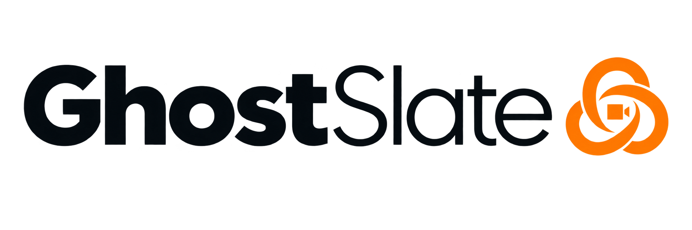
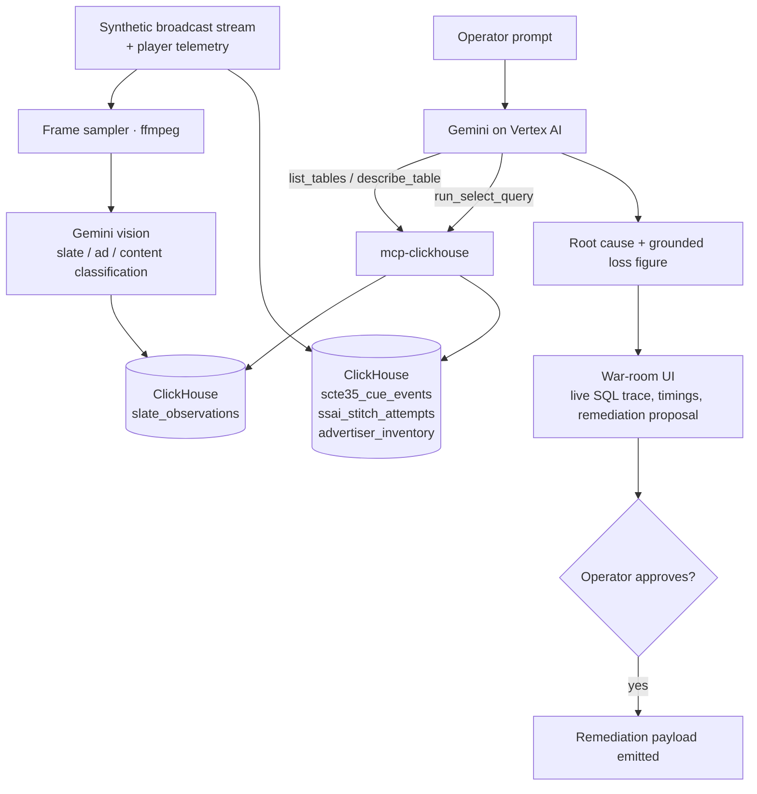

<div align="center">

<picture>
  <source media="(prefers-color-scheme: dark)" srcset="web/public/brand/ghostslate-lockup-dark.png">
  <source media="(prefers-color-scheme: light)" srcset="web/public/brand/ghostslate-lockup.png">
  
</picture>

<br />
<br />

**Autonomous forensics for SSAI "silent bleed" — the ad failure every dashboard reports as healthy.**

[Problem](#the-problem) · [How it works](#how-it-works) · [Tech stack](#tech-stack) · [Local setup](#local-setup) · [Development](#development)

[](LICENSE)
[](.nvmrc)
[](https://www.typescriptlang.org/)
[](https://github.com/ClickHouse/mcp-clickhouse)
[](https://cloud.google.com/vertex-ai)

</div>

---

## The Problem

In live sports and FAST channels, ads are stitched into the stream server-side (SSAI), triggered by
SCTE-35 cue markers embedded in the transport stream. When an ad auction times out or a cue drifts,
the stitcher does not crash — it falls back to a looping "We'll Be Right Back" slate.

Every monitoring layer reports **HTTP 200 OK**. Video is playing. Bitrate is nominal. Nothing
alerts. Meanwhile paid ad inventory has been silently replaced with zero-revenue filler, and the
first person to notice is an advertiser asking why their impressions never landed.

**The failure is invisible to logs but obvious to the eye.** That is the entire premise: closing the
gap needs something that can _look_ at the stream and _reason_ over telemetry at the same time — a
multimodal agent, not a text-to-SQL model and not a dashboard.

## What It Does

GhostSlate investigates a suspected revenue drop the way a broadcast analyst would, and shows its
work while doing it:

1. **Sees the slate.** Gemini vision classifies sampled player frames as slate, ad, or content —
   detecting filler cards that status codes hide.
2. **Explains it.** Correlates each visual detection against SCTE-35 cue events and SSAI stitcher
   logs in ClickHouse, using `ASOF JOIN` temporal matching to pair a cue with the stitch attempt
   that answered it.
3. **Isolates the cause.** Narrows across SSP × device class × codec until one cohort explains the
   anomaly, rather than reporting a channel-wide average.
4. **Prices it.** Computes unmonetized impressions against a rate-card table, so the financial
   figure is derived from data rather than estimated by the model.
5. **Proposes a fix.** Emits a remediation payload for **human approval**. It does not execute
   anything against ad infrastructure.

Two properties are treated as correctness requirements rather than nice-to-haves:

- **Grounding.** Every figure in the agent's answer traces to a value returned by ClickHouse. The
  model never estimates a number it could have queried.
- **Restraint.** Given a window with no real root cause, the agent reports that none was found.
  Small samples (`cues < 20`) are suppressed rather than surfaced as findings.

## How It Works



The agent loop runs: schema discovery → visual anomaly window identification → `ASOF JOIN`
correlation → dimension isolation → loss computation → remediation proposal.

**The agent reaches ClickHouse only through the official
[`mcp-clickhouse`](https://github.com/ClickHouse/mcp-clickhouse) server** over SSE — never through a
direct client. The war-room UI streams each tool call as it happens, with its actual SQL, rows
scanned, and execution time.

## Tech Stack

### Runtime and language

| Technology     | Version     | Why it is here                                                                                   |
| -------------- | ----------- | ------------------------------------------------------------------------------------------------ |
| **Node.js**    | 24.19.0 LTS | Server runtime. Pinned via `engines` + `.nvmrc`, with `engine-strict` so a mismatch fails loudly |
| **TypeScript** | 6.0         | One language across API and UI; domain and API types are never `any`                             |
| **pnpm**       | 11.22       | Workspace manager. The `catalog:` field is what keeps one version of any technology repo-wide    |

### Data layer

| Technology               | Role                                                                                                                                                                                                              |
| ------------------------ | ----------------------------------------------------------------------------------------------------------------------------------------------------------------------------------------------------------------- |
| **ClickHouse**           | Columnar store for cue events, stitch attempts, frame observations and the rate card. Chosen for `ASOF JOIN` — pairing each cue with the stitch attempt that answered it is a temporal join, not an equality join |
| **`mcp-clickhouse`**     | The official MCP server. **The agent's only data path.** Exposes `list_tables`, `describe_table` and `run_select_query` as tools Gemini can call, over SSE                                                        |
| **`@clickhouse/client`** | Direct reads for dashboard panels only. The agent never uses it                                                                                                                                                   |

### AI layer

| Technology              | Role                                                                                                                                                         |
| ----------------------- | ------------------------------------------------------------------------------------------------------------------------------------------------------------ |
| **Gemini on Vertex AI** | Both halves of the product: **vision** classifies sampled frames, **reasoning** drives the tool-calling investigation loop. One model family, two modalities |
| **`@google/genai`**     | Vertex AI SDK. Configured with `vertexai: true`, so it authenticates through Google Cloud rather than an API key                                             |
| **ffmpeg**              | Samples frames from the player at the timestamps under investigation                                                                                         |

### Application

| Technology          | Role                                                                                                                                             |
| ------------------- | ------------------------------------------------------------------------------------------------------------------------------------------------ |
| **Express 5**       | API surface. Also the security boundary — it holds every credential                                                                              |
| **SSE**             | Streams the agent's trace to the UI live. An investigation spans tens of seconds; the operator watches it think rather than waiting on a spinner |
| **Zod**             | Decodes external shapes once at the API boundary                                                                                                 |
| **Pino**            | Structured logging                                                                                                                               |
| **React 19 + Vite** | The war-room UI. Plain React, no meta-framework                                                                                                  |
| **Tailwind CSS v4** | Styling, driven entirely by the design tokens described below                                                                                    |
| **Recharts**        | Time-series panels                                                                                                                               |

### Tooling and infrastructure

| Technology                                   | Role                                                                                                                       |
| -------------------------------------------- | -------------------------------------------------------------------------------------------------------------------------- |
| **Vitest**                                   | One test runner for both packages, version shared via catalog                                                              |
| **ESLint + Prettier + Husky**                | Lint and format, enforced pre-commit via lint-staged                                                                       |
| **Docker Compose**                           | Local development — ClickHouse, MCP server and app in one command                                                          |
| **Google Cloud Run**                         | Deployment target. One container serves the built UI _and_ the API                                                         |
| **Python 3** (`clickhouse-connect`, `faker`) | Anomaly injection only. The bulk synthetic baseline is generated inside ClickHouse with `INSERT ... SELECT FROM numbers()` |

### How it adds up

The pieces are chosen so each one closes a specific gap, and the seams between them are the product:

- **A stream nobody is watching** → ffmpeg samples frames → **Gemini vision** turns pixels into a
  classification row. This is the only step that can see what logs cannot, and its output lands in
  ClickHouse as data the agent can query like any other table.
- **A classification with no explanation** → **ClickHouse** holds the cue markers and stitcher
  outcomes alongside it. `ASOF JOIN` is what makes "which auction answered this cue?" a query
  instead of a guess.
- **A query engine an LLM cannot safely drive** → **`mcp-clickhouse`** exposes schema discovery and
  read-only SELECT as tools with defined shapes. Gemini chooses _which_ question to ask; MCP
  constrains _how_ it can ask. The database account behind it is read-only.
- **A model that could invent a number** → the rate-card table makes the loss figure a computation
  over queried values. Grounding stops being a prompt instruction and becomes a data-flow property.
- **A black box nobody would trust** → **SSE** streams every tool call, its SQL, and its timing to
  the UI as it happens. An operator approves the remediation because they watched the reasoning,
  not because a model asserted a conclusion.
- **A credential problem** → React cannot hold Google Cloud or ClickHouse secrets, so **Express** is
  required rather than optional. It serves the built UI and the API from one container, which is
  also what keeps deployment to a single service on **Cloud Run**.

## Local Setup

### Prerequisites

- **Node 24.19.0 LTS** — `nvm use` picks it up from `.nvmrc`
- **pnpm 11+** — `corepack enable && corepack prepare pnpm@11.22.0 --activate`
- **Docker** and Docker Compose
- **ffmpeg** — only needed if you want to regenerate the demo media
- A **Google Cloud project** with the Vertex AI API enabled

### 1. Clone and configure

```bash
git clone https://github.com/jaswalsaurabh/ghostslate.git
cd ghostslate
cp .env.example .env
```

Edit `.env` and set at minimum:

| Variable                    | Notes                                                                                                |
| --------------------------- | ---------------------------------------------------------------------------------------------------- |
| `GCP_PROJECT_ID`            | Your Google Cloud project                                                                            |
| `GCP_REGION`                | Defaults to `us-central1`                                                                            |
| `CLICKHOUSE_ADMIN_PASSWORD` | Replace the local default before running anywhere but your own machine                               |
| `CLICKHOUSE_AGENT_PASSWORD` | Password for the read-only agent account                                                             |
| `MCP_SERVER_URL`            | `http://localhost:8000` for local dev; `http://mcp-clickhouse:8000` when the app runs inside Compose |

The remaining variables have working local defaults and are documented inline in
[`.env.example`](.env.example).

### 2. Authenticate to Google Cloud

The Vertex AI SDK uses Application Default Credentials — there is no API key to paste.

```bash
gcloud auth application-default login
gcloud config set project YOUR_PROJECT_ID
```

### 3. Start the infrastructure

```bash
docker compose -f infra/docker-compose.yml up -d clickhouse mcp-clickhouse
```

This brings up ClickHouse (`:8123`) and the MCP server (`:8000`), both bound to localhost only. On
first start, the container automatically applies the schema, provisions the read-only
`ghostslate_agent` user, seeds the rate cards, and generates the **101.4M-row baseline telemetry**.
Initial seeding takes about 1–2 minutes. Subsequent starts are instant because the dataset is
persisted in a named Docker volume (`clickhouse_data`). To re-seed from scratch after editing seed
files, run `docker compose -f infra/docker-compose.yml down -v` first.

### 4. Verify ClickHouse status

Check that all four tables are present and populated:

```bash
docker exec ghostslate-clickhouse clickhouse-client \
  --user default --password "${CLICKHOUSE_ADMIN_PASSWORD:-ghostslate_admin_local_dev}" \
  --query "SELECT table, total_rows FROM system.tables WHERE database = 'ghostslate'"
```

You should see `advertiser_inventory` (4 rows), `scte35_cue_events` (14,400 rows), `ssai_stitch_attempts` (101,400,000 rows), and `slate_observations` (0 rows).

#### If you are deploying to ClickHouse Cloud

The Docker Compose init hook runs locally only. For ClickHouse Cloud (the production target), create the read-only `ghostslate_agent` user and grant `SELECT ON ghostslate.* TO ghostslate_agent` via the Cloud console, then apply the three files in order using `clickhouse-client`:

```bash
# Apply schema, rate cards, and baseline telemetry to ClickHouse Cloud
clickhouse-client --host "$CLICKHOUSE_HOST" --port 9440 --secure \
  --user default --password "$CLICKHOUSE_ADMIN_PASSWORD" \
  --multiquery < sql/schema/001_initial_tables.sql

clickhouse-client --host "$CLICKHOUSE_HOST" --port 9440 --secure \
  --user default --password "$CLICKHOUSE_ADMIN_PASSWORD" \
  --multiquery < sql/seed/002-advertiser-inventory.sql

clickhouse-client --host "$CLICKHOUSE_HOST" --port 9440 --secure \
  --user default --password "$CLICKHOUSE_ADMIN_PASSWORD" \
  --multiquery < sql/seed/003-baseline-telemetry.sql
```

Seeding 101.4M rows over network to Cloud takes longer than local Docker; execute it once ahead of deployment. Run `sql/checks/baseline-assertions.sql` against the Cloud instance to verify all 16 assertions and confirm the determinism fingerprint matches local exactly.

### 5. Run the app

```bash
pnpm install
pnpm dev
```

The UI is at **http://localhost:5173**, the API at **http://localhost:8080**. Confirm the API is
healthy:

```bash
curl http://localhost:8080/api/health
```

### Running everything in Docker instead

To run the app as a container alongside the other services:

```bash
docker compose -f infra/docker-compose.yml up --build
```

The war room is then served at **http://localhost:8080**. Two things this path needs that local dev
does not: `MCP_SERVER_URL` must be `http://mcp-clickhouse:8000` (Compose service name, not
`localhost`), and Google credentials must be available inside the container — mount your ADC file
and set `GOOGLE_APPLICATION_CREDENTIALS`.

### Regenerating demo media

The repo ships pre-generated synthetic clips in `web/public/media`. To rebuild them:

```bash
./tools/generate-test-media.sh
```

This composes SVG broadcast cards into short clips with ffmpeg. **No real broadcast footage is used
anywhere in this project.**

### Common issues

| Symptom                                 | Cause                                                                                                                                        |
| --------------------------------------- | -------------------------------------------------------------------------------------------------------------------------------------------- |
| Agent can't reach ClickHouse            | `MCP_SERVER_URL` points at `localhost` from inside a container — use the Compose service name                                                |
| `403` / `PERMISSION_DENIED` from Gemini | Vertex AI API not enabled, or ADC not set up for the right project                                                                           |
| Tables missing or row counts wrong      | The data volume was created by an earlier run. `docker compose -f infra/docker-compose.yml down -v`, then `up -d` to re-run the init scripts |
| `ERR_PNPM_UNSUPPORTED_ENGINE`           | Wrong Node version. `nvm use` reads `.nvmrc`                                                                                                 |

## Architecture

```
web/      Vite + React + TypeScript. Presentation only.
server/   Express API — agent orchestration, MCP client, ClickHouse reads, SSE, ffmpeg.
sql/      Schema DDL and benchmarked analytical queries.
tools/    Synthetic media and data generation.
eval/     Ground-truth incident cases.
infra/    Dockerfile, docker-compose, Cloud Run configuration.
```

`server/` layers as route → controller → service. Routes wire middleware, controllers translate
results to HTTP, services own logic and data access and never see `req`/`res`. Services raise typed
domain errors that the HTTP layer maps to status codes in one place.

### API surface

| Endpoint                 | Method | Purpose                                                       |
| ------------------------ | ------ | ------------------------------------------------------------- |
| `/api/health`            | GET    | Service and dependency health                                 |
| `/api/vision/classify`   | POST   | Classify a sampled frame via Gemini vision                    |
| `/api/investigate/spike` | POST   | Run an investigation, streaming the agent trace back over SSE |

### Data model

| Table                  | Holds                                                           |
| ---------------------- | --------------------------------------------------------------- |
| `scte35_cue_events`    | Cue markers — splice event, cue time, expected break duration   |
| `ssai_stitch_attempts` | Stitcher outcomes — status, SSP, auction latency, device, codec |
| `slate_observations`   | Frame classifications written by the vision pipeline            |
| `advertiser_inventory` | Rate card — CPM and fill target, which grounds the loss figure  |

`LowCardinality` is applied to the dimension columns the correlation query groups by. The schema
lives in [`sql/`](sql/), not in application code.

### A note on the ASOF JOIN

`ASOF JOIN` returns exactly one matched row per left row, so a percentage computed per
`splice_event_id` can only ever be 0% or 100%. The correlation query therefore aggregates _across_
cues, with a `HAVING cues >= 20` guard so noise cannot surface as a root cause. This is the
highest-risk logic in the repo and is covered by tests against a fixture with a known ratio.

### Security boundary

No credentials reach the browser. The web app talks only to the API; the API holds every secret and
talks to ClickHouse, MCP and Vertex AI. The agent's database account is read-only by design — its
input path is untrusted text reaching a SQL engine, and a role that cannot write is the only durable
defence.

### Design system

The UI is built on a three-tier token architecture — primitive → semantic → component — with runtime
theme switching and no hardcoded colours in components. The full reference is in
[`.agent/design-system.md`](.agent/design-system.md).

## Development

```bash
pnpm dev            # web + API in watch mode
pnpm build          # build both packages
pnpm test           # vitest across the workspace
pnpm typecheck
pnpm lint           # pnpm lint:fix to autofix
pnpm format
pnpm dedupe:check
```

**Dependency discipline.** One version of any technology, repo-wide. Shared versions are declared
once in `pnpm-workspace.yaml` under `catalog:` and referenced as `"catalog:"`, never as a literal
range; `pnpm.overrides` collapses transitive duplicates. Run `pnpm dedupe --check` before any commit
that touches dependencies.

**Testing.** Tests guard the logic that produces the diagnosis — the `ASOF JOIN` aggregation, the
grounding rule, loss attribution, small-sample guarding, and the negative control. React rendering,
HTTP wiring and the SSE transport are not unit-tested; they fail loudly and are covered by the demo
path. Coverage percentage is not a goal.

Engineering conventions for contributors and coding agents live in [`AGENTS.md`](AGENTS.md).

## Status

Built for the Agentic Cinema hackathon, ClickHouse track. Active development — the schema, MCP
transport, API surface, vision pipeline and war-room UI are in place; the data generator and
evaluation harness are in progress.

## Contributing

Issues and pull requests are welcome. Please read [`AGENTS.md`](AGENTS.md) first — it is the
engineering contract for this repo and covers layering, dependency rules, testing scope and the
complexity budget.

## License

[MIT](LICENSE) © 2026 Saurabh Jaswal

Demo media is synthetic. No real broadcast footage is used anywhere in this project.
