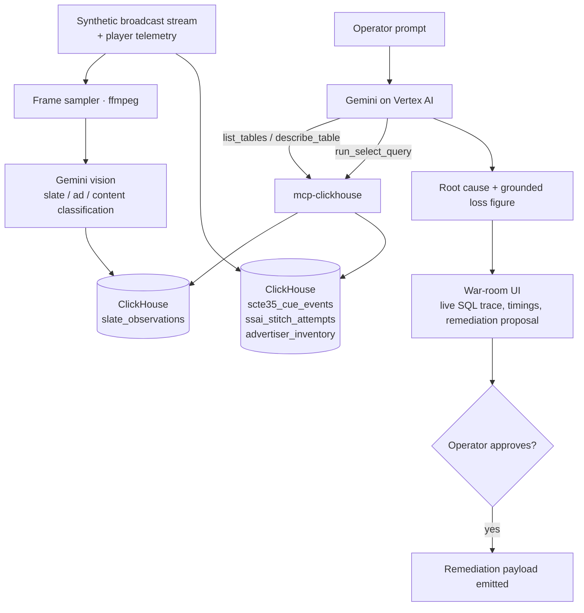

<div align="center">

# GhostSlate AI

**Autonomous forensics for SSAI "silent bleed" — the ad failure every dashboard reports as healthy.**

[Problem](#the-problem) · [How it works](#how-it-works) · [Quick start](#quick-start) · [Architecture](#architecture) · [Development](#development)

[](LICENSE)
[](.nvmrc)
[](https://www.typescriptlang.org/)
[](https://github.com/ClickHouse/mcp-clickhouse)
[](https://cloud.google.com/vertex-ai)

</div>

---

## The Problem

In live sports and FAST channels, ads are stitched into the stream server-side (SSAI), triggered by
SCTE-35 cue markers. When an ad auction times out or a cue drifts, the stitcher does not crash — it
falls back to a looping "We'll Be Right Back" slate.

Every monitoring layer reports **HTTP 200 OK**. Video is playing. Nothing alerts. Meanwhile paid ad
inventory has been silently replaced with zero-revenue filler.

**The failure is invisible to logs but obvious to the eye.** Closing that gap needs a multimodal
agent, not a text-to-SQL model.

## What It Does

GhostSlate is a forensic agent that investigates a suspected revenue drop the way an analyst would:

1. **Sees the slate.** Gemini vision classifies sampled player frames, detecting filler cards that
   status codes hide.
2. **Explains it.** Correlates each visual detection against SCTE-35 cue events and SSAI stitcher
   logs in ClickHouse, using `ASOF JOIN` temporal matching.
3. **Prices it.** Computes unmonetized impressions against a rate-card table, so the financial
   figure is derived from data rather than estimated by the model.
4. **Proposes a fix.** Emits a remediation payload for **human approval**. It does not execute
   anything against ad infrastructure.

Two properties are treated as correctness requirements rather than nice-to-haves:

- **Grounding.** Every figure in the agent's answer traces to a value returned by ClickHouse. The
  model never estimates a number it could have queried.
- **Restraint.** Given a window with no real root cause, the agent reports that none was found.
  Small samples (`cues < 20`) are suppressed rather than reported as findings.

## How It Works



The agent loop is: schema discovery → visual anomaly window identification → `ASOF JOIN`
correlation → dimension isolation (SSP × device × codec) → loss computation → remediation proposal.

**The agent reaches ClickHouse only through the official
[`mcp-clickhouse`](https://github.com/ClickHouse/mcp-clickhouse) server** over SSE. The war-room UI
surfaces each tool call with its actual SQL, rows scanned, and execution time.

## Quick Start

### Prerequisites

- [Node 24.19.0 LTS](https://nodejs.org) (`.nvmrc` provided) and pnpm 11+
- Docker and Docker Compose
- A Google Cloud project with the Vertex AI API enabled

### Run it

```bash
git clone https://github.com/jaswalsaurabh/ghostslate.git
cd ghostslate
cp .env.example .env      # fill in GCP_PROJECT_ID and your ClickHouse settings
docker compose -f infra/docker-compose.yml up
```

This starts ClickHouse, the `mcp-clickhouse` server, and the application. The war room is served at
`http://localhost:8080`.

To run the app directly against those services instead:

```bash
pnpm install
pnpm dev          # web on :5173, API on :8080
```

### Configuration

All configuration is environment-driven and documented in [`.env.example`](.env.example). The values
that must be set for a real run:

| Variable                                | Purpose                                         |
| --------------------------------------- | ----------------------------------------------- |
| `GCP_PROJECT_ID`, `GCP_REGION`          | Vertex AI project for Gemini                    |
| `CLICKHOUSE_HOST`, `CLICKHOUSE_PORT`    | ClickHouse endpoint (port 8443 + TLS for Cloud) |
| `CLICKHOUSE_USER`, `..._AGENT_PASSWORD` | Read-only account the agent queries through     |

**No credentials reach the browser.** The web app talks only to the API; the API holds every secret
and talks to ClickHouse, MCP, and Vertex AI. The agent's database account is read-only by design —
its input path is untrusted text reaching a SQL engine, and a role that cannot write is the only
durable defence.

## Architecture

```
web/      Vite + React + TypeScript. Presentation only.
server/   Express API — agent orchestration, MCP client, ClickHouse reads, SSE, ffmpeg.
sql/      Schema DDL and benchmarked analytical queries.
tools/    Synthetic data generation and anomaly injection.
eval/     Ground-truth incident cases.
infra/    Dockerfile, docker-compose, Cloud Run configuration.
```

`server/` layers as route → controller → service. Routes wire middleware, controllers translate
results to HTTP, services own logic and data access. Services raise typed domain errors that the
HTTP layer maps to status codes in one place.

### Data model

| Table                  | Holds                                                           |
| ---------------------- | --------------------------------------------------------------- |
| `scte35_cue_events`    | Cue markers — splice event, cue time, expected break duration   |
| `ssai_stitch_attempts` | Stitcher outcomes — status, SSP, auction latency, device, codec |
| `slate_observations`   | Frame classifications written by the vision pipeline            |
| `advertiser_inventory` | Rate card — CPM and fill target, which grounds the loss figure  |

`LowCardinality` is applied to the dimension columns the correlation query groups by. The schema
lives in [`sql/`](sql/), not in application code.

### A note on the ASOF JOIN

`ASOF JOIN` returns exactly one matched row per left row, so a percentage computed per
`splice_event_id` can only ever be 0% or 100%. The correlation query therefore aggregates _across_
cues, with a `HAVING cues >= 20` guard so noise cannot surface as a root cause. This is the
highest-risk logic in the repo and is covered by tests against a fixture with a known ratio.

### Design system

The UI is built on a three-tier token architecture — primitive → semantic → component — with
runtime theme switching. The full reference is in
[`.agent/design-system.md`](.agent/design-system.md).

## Development

```bash
pnpm dev            # web + API in watch mode
pnpm build          # build both packages
pnpm test           # vitest across the workspace
pnpm typecheck
pnpm lint
pnpm format
```

**Dependency discipline.** One version of any technology, repo-wide. Shared versions are declared
once in `pnpm-workspace.yaml` under `catalog:` and referenced as `"catalog:"`, never as a literal
range; `pnpm.overrides` collapses transitive duplicates; `engine-strict` makes a Node mismatch fail
loudly. Run `pnpm dedupe --check` before any commit that touches dependencies.

**Testing.** Tests guard the logic that produces the diagnosis — the `ASOF JOIN` aggregation, the
grounding rule, loss attribution, small-sample guarding, and the negative control. React rendering,
HTTP wiring, and the SSE transport are not unit-tested; they fail loudly and are covered by the demo
path. Coverage percentage is not a goal.

Engineering conventions for contributors and coding agents live in [`AGENTS.md`](AGENTS.md).

## Status

Built for the Agentic Cinema hackathon, ClickHouse track. Active development — the schema, MCP
transport, API surface, vision pipeline, and war-room UI are in place; the data generator and
evaluation harness are in progress.

## Contributing

Issues and pull requests are welcome. Please read [`AGENTS.md`](AGENTS.md) first — it is the
engineering contract for this repo and covers layering, dependency rules, testing scope, and the
complexity budget.

## License

[MIT](LICENSE) © 2026 Saurabh Jaswal

Demo media is synthetic. No real broadcast footage is used anywhere in this project.
