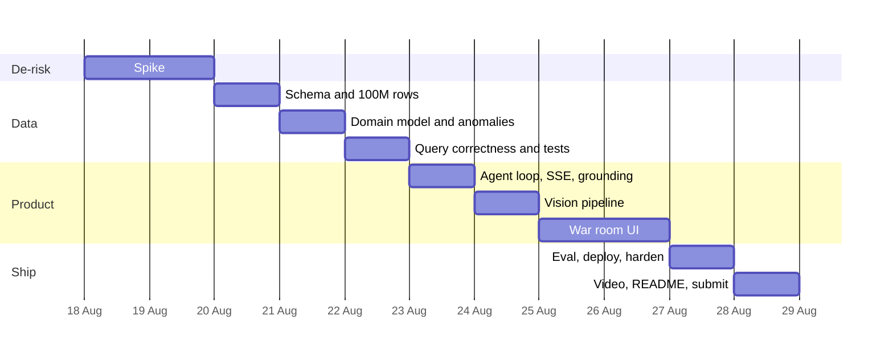

# GhostSlate — 11-Day Roadmap

**Inception → production deployment on Cloud Run → submission.**

| | |
|---|---|
| Day 1 | Tue 18 Aug 2026 |
| Day 11 | Fri 28 Aug 2026 |
| Submission deadline | **Wed 9 Sep 2026, 2:00pm PDT** (~2:30am IST, 10 Sep) |
| Slack after Day 11 | 11 days |

The slack is deliberate, not padding. It absorbs the two risks this plan cannot eliminate: the
Agent Builder integration behaving differently than documented, and the unresolved **Sept 7 vs
Sept 9** deadline conflict between Google's announcement and the Devpost page. Treat **Sun 6 Sep**
as the real deadline until you have confirmed the live countdown.

---

## Phases

---

## Day 0 — Prerequisites (do before Day 1)

Not a build day. Blockers that cost hours if discovered mid-sprint.

- [ ] Google Cloud project created, billing enabled, credits applied
- [ ] Vertex AI API enabled; confirm Agent Builder is available in your region
- [ ] ClickHouse Cloud trial started (30 days from signup covers through submission)
- [ ] `git init`, first commit, **`LICENSE` added** (MIT or Apache-2.0 — OSI, commercial use permitted)
- [ ] Node 24.19.0 via `nvm use`, `pnpm install` succeeds clean
- [ ] Devpost registration confirmed; live countdown date recorded

---

## Day 1 — Spike: prove the riskiest path

**Goal:** Gemini, running through Agent Builder, executes one real SQL query against ClickHouse via
the official `mcp-clickhouse` server, and you see the result.

Nothing else. No schema design, no UI, no domain modelling. This is the single integration you have
never done, and every other estimate in this plan is reliable only if this one works.

- [ ] `mcp-clickhouse` running in Docker against ClickHouse Cloud
- [ ] `list_tables` / `describe_table` / `run_select_query` responding to direct calls
- [ ] One hardcoded table with a hundred rows
- [ ] Agent Builder configured with the MCP endpoint (ngrok or Cloud Run for the tunnel)
- [ ] A prompt causes a real `run_select_query` call and returns a grounded answer

**Exit criteria:** you have a trace showing Gemini calling MCP and citing a real returned value.

---

## Day 2 — Spike hardening + GO/NO-GO

**Goal:** the spike survives contact with reality, and you commit to the project or pivot.

- [ ] Agent self-corrects after a deliberately malformed SQL attempt
- [ ] Multi-turn: schema discovery, then a query informed by what it discovered
- [ ] Express server drives the run (not the Agent Builder console)
- [ ] Tool calls stream to a terminal client over SSE
- [ ] Secrets in env / Secret Manager, never in code

> ### ⚠️ GO/NO-GO GATE — end of Day 2
> If Gemini is not reliably calling MCP tools and citing real values, **stop and switch to StreamOps
> Commander**. Same stack, same data layer, no vision pipeline, no SCTE-35 domain risk. Deciding here
> costs you two days. Deciding on Day 8 costs you the submission.

---

## Day 3 — Schema and data at scale

**Goal:** 100M+ rows in ClickHouse, queryable in tens of milliseconds.

- [ ] DDL in `sql/`: `scte35_cue_events`, `ssai_stitch_attempts`, `slate_observations`, `advertiser_inventory`
- [ ] `LowCardinality` on ssp_id, device_class, codec, stitch_status
- [ ] Baseline generated **in-database** via `INSERT ... SELECT FROM numbers()` — not pushed from Python
- [ ] Diurnal traffic shape, realistic auction-latency distribution
- [ ] Row counts and storage size recorded

**Exit criteria:** a full-table aggregation over 100M rows returns in well under a second.

---

## Day 4 — Domain model and anomaly injection

**Goal:** the data reflects how SCTE-35 and SSAI actually behave, and the incidents are honest.

- [ ] SCTE-35 study: splice_insert, avail_num, segmentation_type_id, cue timing semantics
- [ ] Schema corrected against what you learned
- [ ] Python injector in `tools/generator/`: primary incident (SSP auction latency breaching the
      stitcher deadline for one device/codec cohort)
- [ ] **Confounders:** benign latency spikes, an unrelated regional blip, normal diurnal variation
- [ ] **Negative-control window** with no real root cause

**Timebox:** if the domain work overruns, ship a simplified but *internally consistent* cue model.
A coherent simplification reads as a design decision; a half-correct real spec reads as a mistake.

---

## Day 5 — Query correctness

**Goal:** the analytical core is right and proven right.

- [ ] Corrected ASOF JOIN aggregating **across** cues (never a denominator of 1)
- [ ] `HAVING cues >= 20` small-sample guard
- [ ] `AggregatingMergeTree` rollup for auction-latency quantiles
- [ ] Loss attribution query joined to `advertiser_inventory`
- [ ] **Vitest:** ASOF aggregation, denominator-of-one trap, loss attribution, small-sample guard
- [ ] Every query benchmarked; timings recorded for the UI badge

**Exit criteria:** queries isolate the planted incident *and* stay silent on the negative control —
verified by test, not by eye.

---

## Day 6 — Agent orchestration

**Goal:** the full reasoning loop runs from your own server and streams.

- [ ] Investigation service: schema discovery → correlation → dimension isolation → loss → proposal
- [ ] System prompt enforcing iterative narrowing
- [ ] SSE stream: each tool call with its **actual SQL**, rows scanned, execution time
- [ ] **Grounding rule enforced and tested** — every number traces to a queried value
- [ ] Idempotent runs keyed by normalised input; reconnect attaches to the run in flight

---

## Day 7 — Vision pipeline

**Goal:** Gemini sees the slate that the logs cannot.

- [ ] ffmpeg frame sampling from synthetic stream media
- [ ] Gemini multimodal classification: slate / content / ad
- [ ] Classifications written to `slate_observations`
- [ ] Cached by frame content hash — no frame classified twice
- [ ] Visual detections correlate to cue events in the agent's reasoning

**Do not cut this.** It is what makes the project need Gemini rather than any text-to-SQL model.

---

## Days 8–9 — War room UI

**Goal:** a complete product experience. Design is 25% of the score.

Day 8 — structure:
- [ ] Vite + React + Tailwind v4 shell, dark ops aesthetic
- [ ] Prompt input, live agent trace panel, SSE wired
- [ ] SQL displayed verbatim with timing and rows-scanned badges

Day 9 — substance:
- [ ] Classified frame thumbnails with confidence
- [ ] Timeline and dimension-breakdown charts (Recharts)
- [ ] Diagnosis panel with the grounded loss figure
- [ ] Remediation proposal + explicit operator approval step
- [ ] Preset scenario switcher for deterministic demo runs

**Exit criteria:** someone unfamiliar with the project understands what broke and what it cost,
without narration.

---

## Day 10 — Evaluation and production deployment

**Goal:** it runs in production and behaves the same twice.

- [ ] `eval/` ground-truth cases: primary incident, a second incident, the negative control
- [ ] Assert per case: expected root-cause dimension, minimum MCP calls, grounded figures, correct
      silence on the negative control
- [ ] Dockerfile: one container, Express serving built static assets + API
- [ ] Deployed to **Cloud Run**; secrets via Secret Manager; generous request timeout for SSE
- [ ] `docker-compose.yml` verified from a **cold clone** on a clean directory
- [ ] Hosted URL live and reachable

---

## Day 11 — Submission

**Goal:** submitted, not merely finished.

- [ ] Demo video ≤3 min per `PROJECT-OVERVIEW.md` §10, including the negative control beat
- [ ] Public on YouTube/Vimeo, English or subtitled
- [ ] **No real broadcast footage**
- [ ] README: what it is, architecture, setup that works from cold clone, tech used
- [ ] `LICENSE` present and visible in the repo's About section
- [ ] Repo public; Devpost form complete; **ClickHouse track selected**
- [ ] Submitted

---

## Risk register

| Risk | Day surfaced | Mitigation |
|---|---|---|
| Agent Builder / MCP integration harder than documented | 1–2 | Spike first; hard gate on Day 2; StreamOps fallback |
| SCTE-35 domain modelling overruns | 4 | Timebox; ship a consistent simplification |
| Agent unreliable across runs | 6, 10 | Eval cases + idempotent cached replay for the demo |
| Demo run fails on recording day | 11 | Preset scenarios; replay from cache; record early |
| Vision adds latency that ruins pacing | 7 | Pre-classify frames offline; cache by hash |
| Deadline is Sept 7, not Sept 9 | any | Treat Sept 6 as the deadline until confirmed |

## Definition of done

1. A judge clones the repo, runs `docker-compose up`, and it works.
2. The hosted URL performs a full investigation live.
3. Every number the agent states traces to a ClickHouse value.
4. The agent stays silent on the negative control.
5. The video shows real SQL, real timings, and the visual detection.
6. License, track, repo visibility and form are all correct.

## Non-goals

Multi-channel or multi-tenant support · auth and user accounts · auto-executing remediation ·
encoder cue drift (stretch only) · Redis or any queue · coverage targets · Turborepo.
